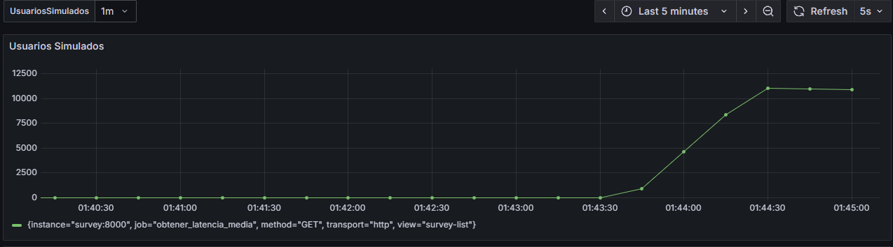
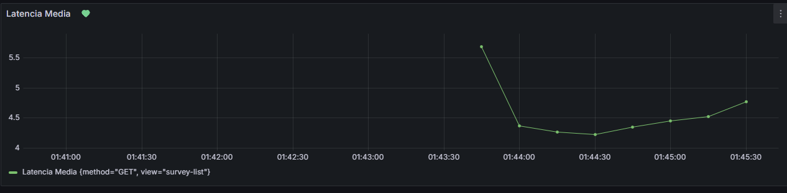
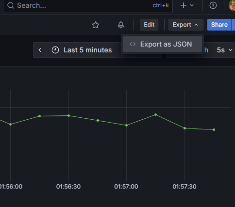
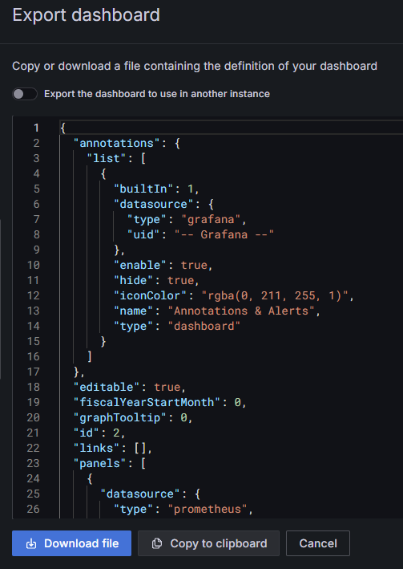

# README de Operaciones - Sistema de Monitoreo con Grafana

## 📋 Descripción General
Este documento describe el proceso completo para clonar, ejecutar y validar el sistema de monitoreo con Grafana, Prometheus y Node Exporter para la aplicación de encuestas.

---

### Pasos: Clonar → Ejecutar → Validar

### 1. **CLONAR**
```bash
# Clonar el repositorio
git clone https://github.com/W4lci/prototipo-encuestas.git
cd prototipo-encuestas/Encuestas2

```

### 2. **EJECUTAR**
```bash
# Iniciar el stack de monitoreo
docker-compose -f docker-compose.ops.yml up -d

# Verificar que todos los servicios están ejecutándose
docker-compose -f docker-compose.ops.yml ps

# Hace falta también iniciar el sistema entonces ejecutamos el archivo docker-compose sin .ops
docker-compose up -d 

# Script que permite levantar todo: 

```

### 3. **VALIDAR**
```bash
curl http://localhost:3000  # Grafana
curl http://localhost:9090  # Prometheus
curl http://localhost:9100  # Node Exporter
curl http://localhost:8025  # MailHog
```
## ¿Como saber si está vigilando a la APP? 
    - Entrar a http://localhost:3000, ir a los graficos
    - Utilizar una forma de simular conexiones, como wrk
  
---

## Variables y Puertos

### **Servicios y Puertos**
| Servicio | Puerto Host | Puerto Contenedor | URL de Acceso |
|----------|-------------|-------------------|---------------|
| **Grafana** | 3000 | 3000 | http://localhost:3000 |
| **Prometheus** | 9090 | 9090 | http://localhost:9090 |
| **Node Exporter** | 9100 | 9100 | http://localhost:9100/metrics |
| **MailHog** | 8025 | 8025 | http://localhost:8025 |


### **Variables de Entorno - Grafana**
```yaml
GF_SMTP_ENABLED: true
GF_SMTP_SKIP_VERIFY: true  
GF_SMTP_HOST: mailhog:1025
GF_SMTP_FROM_ADDRESS: admin@grafana.localhost
GF_SMTP_FROM_NAME: Grafana
GF_SECURITY_ADMIN_PASSWORD: admin
```

### **Credenciales por Defecto**
- **Grafana**: usuario `admin` / contraseña `admin`
- **Prometheus**: Sin autenticación
- **MailHog**: Sin autenticación


---

## Capturas de Panel y Reportes

### **Dashboard Principal: "Monitoreo"**

#### Panel 1: Usuarios Simulados

- **Tipo**: Time Series
- **Métrica**: `increase(django_http_requests_total_by_view_transport_method_total{view="survey-list"}[$UsuariosSimulados])`
- **Descripción**: Muestra el incremento de requests HTTP a la vista de lista de encuestas
- **Intervalo Variable**: $UsuariosSimulados (1m, 10m, 30m, 1h, 6h, 12h, 1d, 7d, 14d, 30d)

#### Panel 2: Latencia Media

- **Tipo**: Time Series
- **Query A**: `sum by(view, method) (rate(django_http_requests_latency_seconds_by_view_method_sum{view="survey-list", method="GET"}[1m]))`
- **Query B**: `sum by(view, method) (rate(django_http_requests_latency_seconds_by_view_method_count{view="survey-list", method="GET"}[1m]))`
- **Expresión**: `($A / $B) * 1000` (convierte a millisegundos)
- **Descripción**: Calcula y muestra la latencia media de los requests GET al api de Surveys

---

## Estructura de Archivos (Los que se añadieron)

```
Encuestas2/
├── docker-compose.ops.yml          # Docker para levantar los contenedores de monitoreo (tienen que ejecutarse junto a el survey)
├── prometheus.yml                  # Configuración de Prometheus (Solo para hacer scrap cada 15s)
└── grafana/                        # Para configurar todo de forma automatica
    ├── provisioning/
    │   ├── datasources/
    │   │   └── datasources.yaml    
    │   └── dashboards/
    │       └── dashboard.yaml      
    └── dashboards/
        └── dashboard-monitoreo.json # Dashboard JSON exportado
```

---

## Instrucciones para Exportar/Restaurar Dashboard

### **Exportar Dashboard desde Grafana UI:**

1. **Acceder a Grafana**: http://localhost:3000
2. **Navegar al Dashboard**: Ir al dashboard (En nuestro caso monitoreo)
3. **Exportar**: Hacer click donde dice "Export" en la parte superior derecha
4. **Exportar JSON**: 
- Click en Exportar como Json
  
   <div align="center">
   
   
   
   </div>

   - Elegir si usar el switch o no (uno permite importar luego en la UI)

   <div align="center">
   
   
   
   </div>

### **Restaurar Dashboard:**

#### **Opción 1: Provisioning Automático**

- Si se usa el mismo Docker-Compose.ops.yml que tenemos solo hay que:
1. Colocar el archivo JSON en: `./grafana/dashboards/`
2. Reiniciar Grafana: `docker-compose -f docker-compose.ops.yml restart grafana`
3. El dashboard se carga automáticamente al iniciar

#### **Opción 2: Import Manual via UI**
- Para esto se debío de haber marcado la opción que permite inputs al momento de descargar para que sea más sencillo la importación

1. Acceder a Grafana: http://localhost:3000
2. **Import Dashboard**: 
   - Click en "New" → "Import"
   - Aqui tenemos varias opciones, pegar el codigo Json, Arrastrar el Json, usar una URL o ID de un dashboard que ya esté hecho en línea
   - Hacer click en Load
   - Hacer configuraciones extras en caso de ser necesario


